<p align="center">
  
</p>

<p align="center">
  <a href="https://spring-react-to-do-gl2cyoppe-kk-af3453da.vercel.app">
    
  </a>
  <a href="https://springreacttodobykk-50040626068.development.catalystappsail.in">
    
  </a>
  <a href="https://github.com/KARTHIKAKRISHNA123/Spring-React-ToDo-NM">
    
  </a>
  
</p>

<p align="center">
  
  
  
  
  
  
  
</p>

---

> **Built by Karthika Krishna M** — A hands-on deep dive into Spring Boot, REST APIs, JWT Security, Cloud Deployment, and DevOps — from zero knowledge to production. From a local project in Alangulam, Tenkasi, Tamil Nadu to a live, globally deployed distributed system.

---

## 🌐 Live Deployment

| Service | Platform | URL |
|---|---|---|
| **Frontend** |  | https://spring-react-to-do-gl2cyoppe-kk-af3453da.vercel.app |
| **Backend** |  | https://springreacttodobykk-50040626068.development.catalystappsail.in |
| **Database** |  | PostgreSQL — Mumbai Region (ap-south-1) |

---

## 📋 Table of Contents

1. [Project Overview](#1-project-overview)
2. [Live Architecture](#2-live-architecture)
3. [Tech Stack — A to Z](#3-tech-stack--a-to-z)
4. [Backend Deep Dive](#4-backend-deep-dive)
5. [Frontend Deep Dive](#5-frontend-deep-dive)
6. [API Reference](#6-api-reference)
7. [Database Strategy](#7-database-strategy)
8. [Security — JWT & Spring Security](#8-security--jwt--spring-security)
9. [DevOps & Cloud Deployment](#9-devops--cloud-deployment)
10. [The CORS Battle — 24 Hours of Debugging](#10-the-cors-battle--24-hours-of-debugging)
11. [Learning Journey — Spring Boot from Zero](#11-learning-journey--spring-boot-from-zero)
12. [Known Issues & Fixes](#12-known-issues--fixes)
13. [Local Development Setup](#13-local-development-setup)
14. [Architectural Diagrams](#14-architectural-diagrams)
15. [Project Status](#15-project-status)

---

## 1. Project Overview

This is a **production-grade, full-stack task management application** built from scratch — not a tutorial clone. It simulates the architecture of a real-world distributed system with:

- A **Spring Boot REST API** serving as the backend engine
- A **React + Vite frontend** with Todoist-inspired dark mode UI and Google Labs-inspired 3D bento grid cards
- **JWT stateless authentication** for secure, scalable user sessions
- **Supabase PostgreSQL** as the cloud database
- Deployed on **Zoho Catalyst AppSail** (backend) and **Vercel** (frontend)

The project began as a local "Hello World" Spring Boot app and evolved into a live, globally accessible distributed system — a journey that included 24+ hours of deployment debugging, CORS battles, database migrations, and cloud infrastructure configuration.

---

## 2. Live Architecture

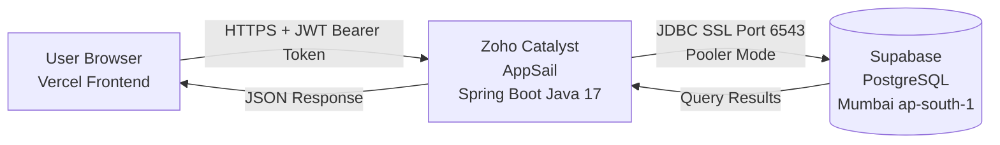

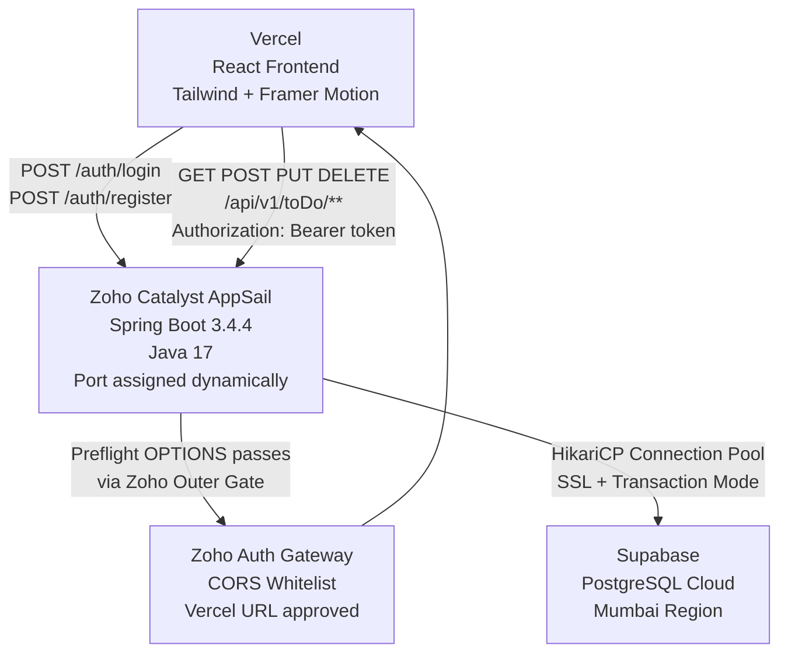

---

## 3. Tech Stack — A to Z

### 3.1 Backend

<p align="left">
  
  
  
  
  
  
  
  
</p>

| Package | Full Form | Why We Use It |
|---|---|---|
|  | Spring Web MVC Starter | REST API support via `@RestController`. Includes embedded Apache Tomcat. |
|  | Spring Data JPA Starter | JPA = Java Persistence API. ORM via Hibernate. Write Java objects instead of SQL. |
|  | Spring Security Starter | JWT filter chain, CORS, BCrypt hashing, route protection. |
|  | Bean Validation Starter | `@NotBlank`, `@NotNull`, `@Email` on entity fields. |
|  | PostgreSQL JDBC Driver | Connects Spring Boot to PostgreSQL via JDBC. |
|  | Java JWT Library (JJWT) | Generates, signs, validates JWT tokens using HS256. |
|  | Project Lombok | `@Data`, `@Builder`, `@NoArgsConstructor` — eliminates boilerplate. |

### 3.2 Frontend

<p align="left">
  
  
  
  
  
  
  
  
</p>

| Package | Full Form | Why We Use It |
|---|---|---|
|  | React JavaScript Library | Component-based UI. Entire frontend is isolated, reusable components. |
|  | Vite Build Tool | Lightning-fast dev server with HMR. Much faster than Create React App. |
|  | Tailwind CSS Framework | Utility-first — styles are class names inside JSX. No separate CSS files. |
|  | Framer Motion | 3D card tilts, staggered entrance animations, spring physics. |
|  | Axios HTTP Client | Interceptors auto-attach JWT token to every request. |
|  | TanStack Query | Server state management. Replaces `useEffect` for API calls. |
|  | React Router DOM | Client-side routing between pages without reloads. |
|  | React Hook Form | Form validation without re-rendering on every keystroke. |
|  | Lucide React Icons | SVG icons — Trash2, Edit2, LogOut, Plus, Check, RotateCcw. |
|  | React Hot Toast | Toast notifications for login, register, CRUD feedback. |

### 3.3 DevOps & Infrastructure

<p align="left">
  
  
  
  
  
  
  
</p>

| Tool | Full Form | Purpose |
|---|---|---|
|  | Apache Maven Wrapper | Java build tool. Compiles, resolves dependencies, packages JAR. |
|  | Zoho Cloud Platform | Backend hosting. Dynamic ports. 10-second startup window. |
|  | Vercel Deployment Platform | Frontend hosting. Auto-deploys on GitHub push. |
|  | Supabase Cloud Database | Managed PostgreSQL. Mumbai region. Transaction pooler port 6543. |
|  | HikariCP Connection Pool | Spring Boot's default JDBC pool. Manages Supabase connections. |

---

## 4. Backend Deep Dive

### 4.1 Project Structure

```
com.kk.HelloWorld/
├── HelloWorldApplication.java      @SpringBootApplication — Entry point
├── JwtFilter.java                  OncePerRequestFilter — Validates JWT on every request
│
├── config/
│   ├── SecurityConfig.java         Nuclear CORS Filter + JWT Security Chain
│   └── ServerPortCustomizer.java   Reads X_ZOHO_CATALYST_LISTEN_PORT env variable
│
├── controller/
│   ├── AuthController.java         POST /auth/register, POST /auth/login
│   ├── HealthController.java       GET / — Zoho health check endpoint
│   ├── ToDoController.java         Full CRUD — /api/v1/toDo/**
│   ├── HelloWorldController.java   GET /hello — test endpoint
│   └── KKController.java           GET /kk — test endpoint
│
├── models/
│   ├── ToDo.java                   @Entity — todo table
│   └── User.java                   @Entity — user_table
│
├── repository/
│   ├── ToDoRepository.java         extends JpaRepository<ToDo, Long>
│   └── UserRepository.java         extends JpaRepository<User, Long>
│
├── service/
│   ├── ToDoService.java            CRUD business logic + pagination
│   └── UserService.java            User creation
│
└── utils/
    └── JwtUtil.java                HS256 token generation + validation
```

### 4.2 The 3-Tier Layered Architecture

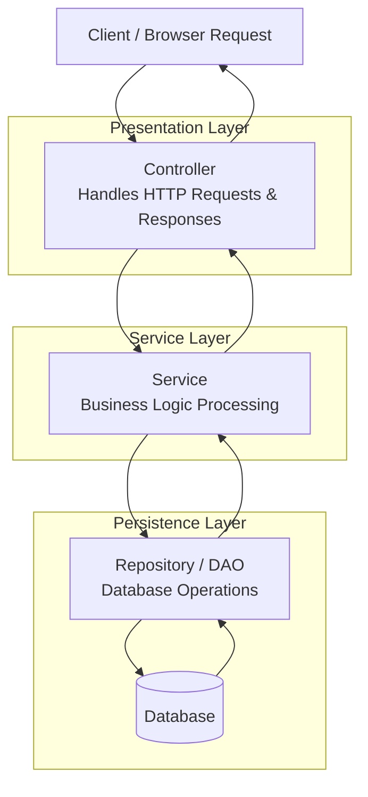

**Key Rule**: Layers never skip each other. Controller → Service → Repository → Database. Always.

### 4.3 Spring Core Concepts Applied

**Dependency Injection:**
```java
@Service
public class ToDoService {
    @Autowired
    private ToDoRepository toDoRepository; // Spring injects — not new ToDoRepository()
}
```

**Open/Closed Principle:**
- Switching REST → GraphQL? Only change the Controller layer.
- Switching PostgreSQL → MongoDB? Only change the Repository layer.
- Switching JWT → OAuth? Only change SecurityConfig + JwtFilter.

### 4.4 Maven Build Tool

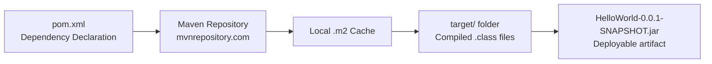

| Command | What It Does |
|---|---|
| `./mvnw clean` | Deletes `target/` folder |
| `./mvnw compile` | Compiles Java source to `.class` bytecode |
| `./mvnw clean package -DskipTests` | Builds final JAR, skips tests |
| `Ctrl+Shift+O` in IntelliJ | Reloads Maven — downloads new dependencies |

### 4.5 REST API — HTTP Methods

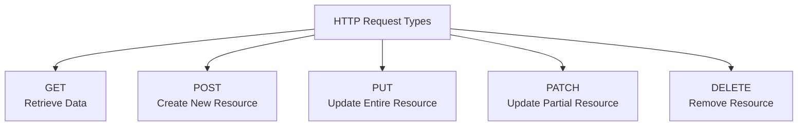

> Before REST there was **SOAP** (Simple Object Access Protocol) — complex XML-based. REST uses simple URLs + HTTP methods.

### 4.6 Spring Data JPA — ORM Layer

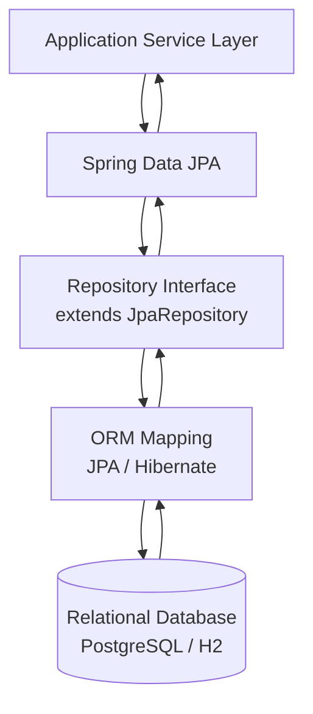

| Annotation | Purpose |
|---|---|
| `@Entity` | Maps Java class to a database table |
| `@Table(name="user_table")` | Overrides default table name |
| `@Id` | Marks the primary key |
| `@GeneratedValue` | Auto-increments ID on insert |
| `@NotBlank` | Field cannot be null, empty, or whitespace |
| `@NotNull` | Field cannot be null (for Boolean types) |
| `@Email` | Validates email format |

### 4.7 Dynamic Port — ServerPortCustomizer

Zoho Catalyst assigns a random port on every startup via environment variable:

```java
@Configuration
public class ServerPortCustomizer
    implements WebServerFactoryCustomizer<ConfigurableServletWebServerFactory> {
    @Override
    public void customize(ConfigurableServletWebServerFactory factory) {
        String port = System.getenv("X_ZOHO_CATALYST_LISTEN_PORT");
        if (port != null) factory.setPort(Integer.parseInt(port));
        else factory.setPort(8081); // local fallback
    }
}
```

---

## 5. Frontend Deep Dive

### 5.1 Project Structure

```
react-todo-frontend/
├── index.html                    Single HTML file — id="root" (not id="app"!)
├── vite.config.js                plugins: [react(), tailwindcss()] — both required
├── package.json
│
└── src/
    ├── main.jsx                  Root — mounts React to #root
    ├── App.jsx                   React Router + TanStack Query + Toaster setup
    ├── index.css                 Tailwind @import + @theme dark mode variables
    │
    ├── api/
    │   ├── axios.js              baseURL from VITE_API_BASE_URL env var + JWT interceptor
    │   └── todoService.js        getAllTodos, createTodo, updateTodo, deleteTodo
    │
    ├── components/
    │   ├── layout/
    │   │   ├── AppLayout.jsx     Flex container — Sidebar + Main content
    │   │   ├── Header.jsx        Todoist logo + red Logout button
    │   │   └── Sidebar.jsx       Left nav — Inbox, Today links
    │   └── todos/
    │       ├── TaskList.jsx      Bento grid — maps todos → TaskItem cards
    │       └── TaskItem.jsx      Google Labs 3D card — tilt, hover, edit, delete
    │
    ├── hooks/
    │   └── useTodos.js           TanStack Query — useQuery + useMutation
    │
    └── pages/
        ├── Dashboard.jsx         Main authenticated view
        ├── Login.jsx             React Hook Form + toast notifications
        └── Register.jsx          React Hook Form + toast notifications
```

### 5.2 Data Flow — From Click to Database

```mermaid
flowchart LR
    A[User adds task\nTaskList.jsx]
    B[useTodos hook\naddTodoMutation]
    C[todoService.createTodo]
    D[axios.js\nAdds Bearer JWT header]
    E[Zoho AppSail\nSpring Boot]
    F[JwtFilter\nvalidates token]
    G[ToDoController\nPOST /api/v1/toDo/create]
    H[ToDoService]
    I[ToDoRepository\n.save]
    J[(Supabase\nPostgreSQL)]

    A --> B
    B --> C
    C --> D
    D -->|HTTPS| E
    E --> F
    F --> G
    G --> H
    H --> I
    I --> J
    J -->|saved entity| I
    I -->|201 Created| G
    G -->|JSON response| E
    E -->|response| D
    D -->|invalidateQueries| B
    B -->|re-fetch + re-render| A
```

### 5.3 Tailwind Dark Mode Theme

```css
@theme {
  --color-background: #1f1f1f;
  --color-foreground: #ffffff;
  --color-primary: #db4c3f;        /* Todoist signature red */
  --color-secondary: #383838;
  --color-muted: #2c2c2c;
  --color-muted-foreground: #a8a8a8;
  --color-border: #363636;
  --color-card: #2c2c2c;
  --sidebar-background: #282828;
}
```

### 5.4 Framer Motion Animations

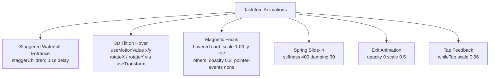

---

## 6. API Reference

All protected endpoints require `Authorization: Bearer <token>` header.

| Method | Endpoint | Auth | Description | Response |
|---|---|---|---|---|
| `GET` | `/` | No | Zoho health check | `200 Backend is Live!` |
| `POST` | `/auth/register` | No | Register new user | `201 Created` / `409 Conflict` |
| `POST` | `/auth/login` | No | Login — returns JWT | `200 {token: "..."}` |
| `GET` | `/api/v1/toDo` | ✅ Yes | Get all todos | `200 List<ToDo>` |
| `GET` | `/api/v1/toDo/{id}` | ✅ Yes | Get specific todo | `200 ToDo` / `404` |
| `GET` | `/api/v1/toDo/page?page=0&size=5` | ✅ Yes | Paginated todos | `200 Page<ToDo>` |
| `POST` | `/api/v1/toDo/create` | ✅ Yes | Create new todo | `201 ToDo` |
| `PUT` | `/api/v1/toDo` | ✅ Yes | Update todo | `200 ToDo` |
| `DELETE` | `/api/v1/toDo/{id}` | ✅ Yes | Delete todo | `200 String` |

**ToDo entity schema:**
```json
{
  "id": 1,
  "title": "Complete Spring Boot deployment",
  "isCompleted": false
}
```

---

## 7. Database Strategy

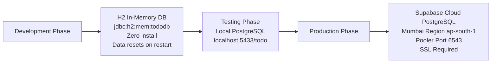

Switching between databases = **3 lines in `application.properties`**. All `@Entity` classes stay the same. This is JPA abstraction.

### Supabase Connection

```properties
spring.datasource.url=jdbc:postgresql://aws-1-ap-south-1.pooler.supabase.com:6543/postgres?sslmode=require&prepareThreshold=0
```

| Parameter | Reason |
|---|---|
| **Port 6543** | Transaction Pooler — required for cloud-to-cloud |
| **`sslmode=require`** | Mandatory for Supabase |
| **`prepareThreshold=0`** | Disables prepared statements for pooler compatibility |
| **Mumbai region** | Closest to Zoho Catalyst Chennai — minimum latency |

---

## 8. Security — JWT & Spring Security

### Login Flow

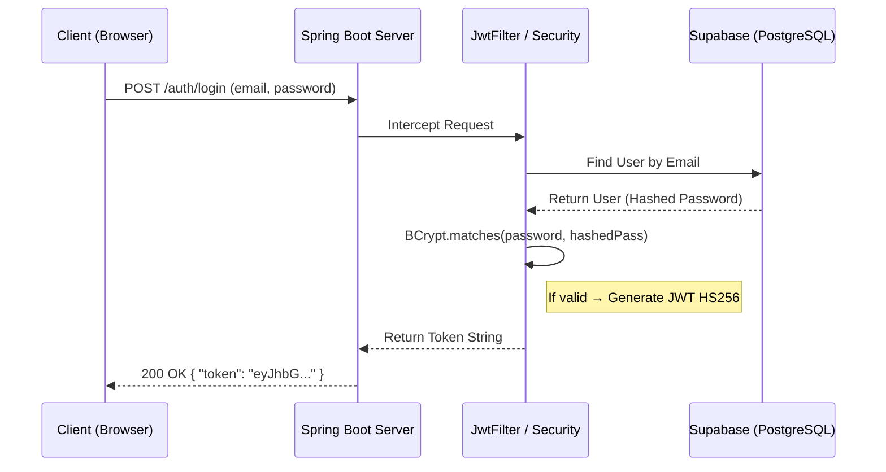

### Every Protected Request

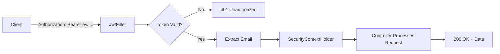

### JWT Structure

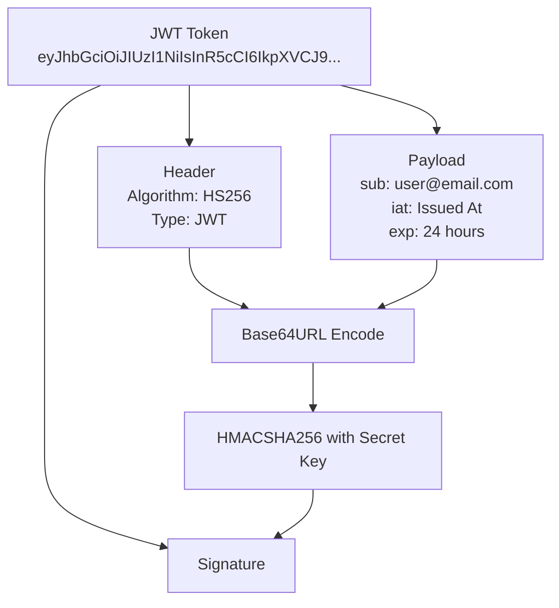

### Security Concepts

| Concept | Full Form | What It Means |
|---|---|---|
|  | JSON Web Token | Signed token. Stateless — server stores nothing. |
| HS256 | HMAC SHA-256 | Symmetric signing. Secret key must be 32+ characters. |
| BCrypt | Blowfish Crypt | One-way password hashing. Never stores plain text. |
| CSRF | Cross-Site Request Forgery | Disabled for REST APIs using stateless JWT. |
| CORS | Cross-Origin Resource Sharing | Browser policy — server must explicitly allow origins. |

---

## 9. DevOps & Cloud Deployment

### Deployment Pipeline

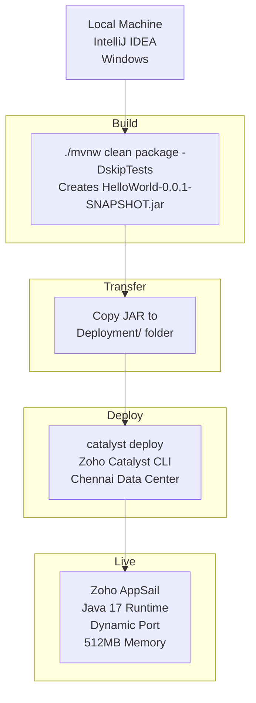

### Manual CI/CD Commands

```bash
# Step 1 — Build
cd D:\SpringToDo\HelloWorld
./mvnw clean package -DskipTests

# Step 2 — Transfer
copy target\HelloWorld-0.0.1-SNAPSHOT.jar ..\Deployment\

# Step 3 — Deploy
cd ..\Deployment
catalyst deploy

# Step 4 — Monitor in Zoho Dashboard → Logs → SpringReactToDoByKK
```

### Zoho `app-config.json`

```json
{
    "command": "java -jar HelloWorld-0.0.1-SNAPSHOT.jar",
    "stack": "java17",
    "memory": 512,
    "platform": "javase",
    "health_check": {
        "type": "http",
        "path": "/",
        "initial_delay": 30
    }
}
```

### The 10-Second Startup Race

Zoho kills apps that don't start within 10 seconds:

| Optimization | Time Saved |
|---|---|
| `spring.jpa.hibernate.ddl-auto=none` | ~3 seconds |
| `spring.main.lazy-initialization=true` | ~2 seconds |
| `spring.data.jpa.repositories.bootstrap-mode=lazy` | ~1 second |
| Removing Swagger dependency | ~2 seconds |
| `HealthController` at `GET /` | Health check passes ✅ |

**Result:** Startup reduced from ~14 seconds → ~6 seconds.

### Java Version Migration

| Phase | Version | Reason |
|---|---|---|
| Local Dev |  | Latest LTS locally |
| Cloud |  | Zoho Catalyst runtime constraint |

### Vercel Frontend Deployment

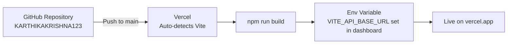

---

## 10. The CORS Battle — 24 Hours of Debugging

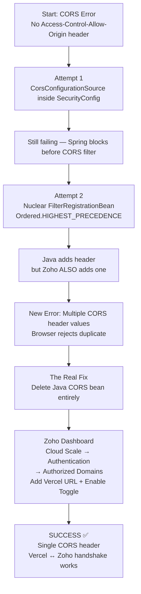

### What Each Error Actually Meant

| Error | What Was Really Happening |
|---|---|
| `"Email might already be taken"` | False alarm — request never reached database. CORS blocked it. |
| `net::ERR_FAILED` | CORS preflight OPTIONS was blocked |
| `No Access-Control-Allow-Origin header` | Backend was offline / not responding |
| `Multiple CORS header values` | Both Zoho AND Java were adding the same header |
| `Execution failed. Please check startup command or port` | App crashed before Tomcat started — DB connection / port issue |

---

## 11. Learning Journey — Spring Boot from Zero

Built from zero Java web framework knowledge in Alangulam, Tenkasi, Tamil Nadu.

### Week-by-Week

| Week | Concept | Key Takeaway |
|---|---|---|
| 1 | `start.spring.io` project setup | Maven generates the skeleton. `mvnw` runs without global Maven. |
| 1 | Embedded Tomcat | Spring Boot bundles its own server. No external install. |
| 1 | REST vs SOAP | SOAP = complex XML. REST = simple URLs + HTTP methods. |
| 1 | `@RestController`, `@GetMapping` | Controller maps URLs to Java methods. |
| 2 | 3-Tier Architecture | Controller → Service → Repository → DB. Never skip layers. |
| 2 | Dependency Injection & IoC | `@Autowired` = Spring injects. No manual `new`. |
| 2 | `@SpringBootApplication` | = `@EnableAutoConfiguration` + `@ComponentScan`. |
| 2 | Request Params / Path Variables / Body | 3 ways to send input to an API. |
| 3 | JPA + Hibernate ORM | `@Entity` → table. `JpaRepository` → free CRUD. |
| 3 | H2 In-Memory Database | Zero-install dev DB. Spring Boot 4.x broke it — use 3.x. |
| 3 | H2 Console debugging | Boot 4.0.4 bug + stale `.class` files = 404. |
| 4 | Spring Security Filter Chain | Every request goes through filters before controllers. |
| 4 | JWT Authentication | Header.Payload.Signature — stateless auth. |
| 4 | BCrypt | Never store plain text passwords. |
| 4 | CORS | Browser blocks cross-origin. Server must allow explicitly. |
| 5 | React + Vite + Tailwind | Both `react()` AND `tailwindcss()` needed in plugins. |
| 5 | Axios interceptors | Auto-attach JWT. No manual headers per call. |
| 5 | TanStack Query | `invalidateQueries` refreshes UI after mutations. |
| 5 | URL mismatch 403 | Frontend `/todos` ≠ backend `/api/v1/toDo`. Always verify. |
| 6 | PostgreSQL migration | H2 → Postgres = 3 lines in `application.properties`. |
| 6 | Email exists bug | `ddl-auto=update` never clears data. Fix: `TRUNCATE TABLE`. |
| 7 | Zoho Catalyst deploy | Java 17. Dynamic port via `ServerPortCustomizer`. |
| 7 | Supabase cloud DB | Pooler 6543. `sslmode=require`. `prepareThreshold=0`. Mumbai. |
| 7 | The localhost trap | `localhost` in cloud = cloud server, not your laptop. |
| 7 | CORS — the final boss | 24 hours. Nuclear filter. Zoho dashboard. Duplicate header. |

### The Biggest Lessons

1. ** Use 3.4.x** — Boot 4.x broke H2 console registration.
2. **Always `Build → Clean Project` after version changes** — Stale `.class` files override everything.
3. **The localhost trap** — `localhost` in cloud config = the cloud server itself.
4. **CORS is a browser policy** — Not a server error. Browser enforces it.
5. **Zoho has two CORS layers** — Java + Dashboard. Both active = duplicate header = blocked.
6. **`ddl-auto=none` in production** — Tables exist. Don't scan on every boot.
7. **JWT is stateless** — The token IS the authentication. Server stores nothing.

---

## 12. Known Issues & Fixes

| Issue | Root Cause | Fix |
|---|---|---|
| Port 8080 in use | Old Spring Boot instance running | `taskkill /PID <id> /F` or `server.port=8081` |
| H2 console 404 | Spring Boot 4.0.4 bug | Downgrade to 3.4.4 + Clean Project |
| Spring Security login page | `spring-boot-starter-security` added twice | Remove duplicate from `pom.xml` |
| `annotation values must be of the form name=value` | `@ComponentScan` wrong multi-package syntax | Use `basePackages = {}` or remove entirely |
| `SecurityConfig.java` not found | File in `src/main/java/` root | Move to `com.kk.HelloWorld.config` package |
| `cannot find symbol AntPathRequestMatcher` | Removed in Spring Security 6.x | Delete premature SecurityConfig |
| Email Already Exists for all registrations | Stale PostgreSQL data | `TRUNCATE TABLE user_table` in pgAdmin |
| `GET /todos 403 Forbidden` | Frontend `/todos` vs backend `/api/v1/toDo` | Fix URLs in `todoService.js` |
| `npm run dev` blank page | `@vitejs/plugin-react` missing, `id="app"` not `"root"` | `npm install -D @vitejs/plugin-react` + fix `index.html` |
| Tailwind styles not applying | `tailwindcss()` missing from `vite.config.js` | Add to `plugins: [react(), tailwindcss()]` |
| `ConflictingBeanDefinitionException` | Two `ServerPortCustomizer` in different packages | Delete root package version |
| `Execution failed. Please check startup command or port` | App not starting in 10s | `ddl-auto=none` + lazy init + correct Mumbai URL |
| CORS Multiple Values Error | Both Zoho AND Java adding CORS header | Remove Java CORS bean — let Zoho handle it |
| Corrupted JDBC URL | Double `jdbc:jdbc:` prefix | Replace entire `application.properties` |

---

## 13. Local Development Setup

### Prerequisites

<p align="left">
  
  
  
  
  
</p>

### Backend Setup

```bash
git clone https://github.com/KARTHIKAKRISHNA123/Spring-React-ToDo-NM.git
cd Spring-React-ToDo-NM/HelloWorld

# For H2 development — uncomment in application.properties:
# spring.datasource.url=jdbc:h2:mem:tododb;DB_CLOSE_DELAY=-1
# spring.datasource.username=sa
# spring.datasource.password=
# spring.h2.console.enabled=true

./mvnw spring-boot:run
# → http://localhost:8081
# → http://localhost:8081/h2-console (dev only)
```

### Frontend Setup

```bash
cd react-todo-frontend
npm install

# Create .env for local dev:
echo "VITE_API_BASE_URL=http://localhost:8081" > .env

npm run dev
# → http://localhost:5173
```

### Environment Variables

| Variable | Location | Value |
|---|---|---|
| `VITE_API_BASE_URL` | Vercel Dashboard / `.env` | Zoho AppSail backend URL |
| `X_ZOHO_CATALYST_LISTEN_PORT` | Zoho (auto-set) | Dynamic port from Catalyst |

---

## 14. Architectural Diagrams

### Full System Architecture

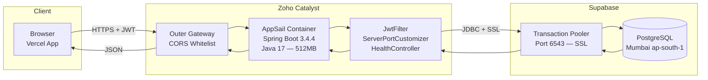

### Java → Spring → Spring Boot

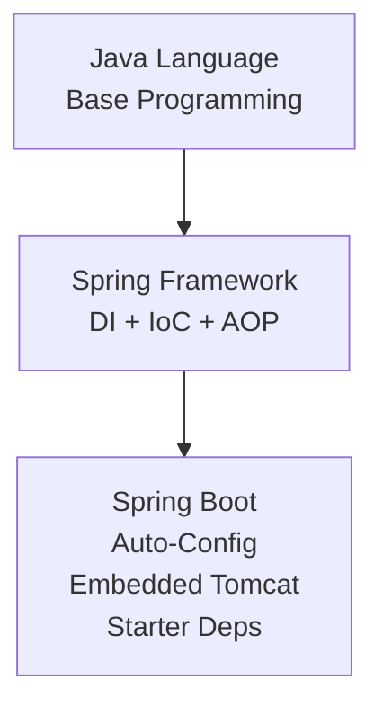

### Spring Security Filter Chain

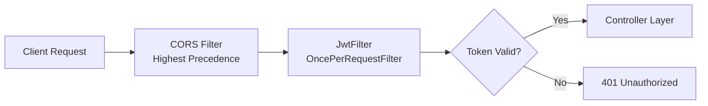

### Port and Network Routing

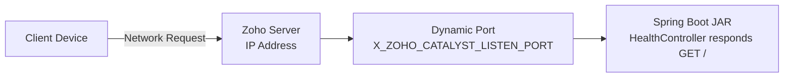

---

## 15. Project Status

| Feature | Status |
|---|---|
|  | ✅ |
|  | ✅ |
|  | ✅ |
|  | ✅ |
|  | ✅ |
|  | ✅ |
|  | ✅ |
|  | ✅ |
|  | ✅ |
|  | ✅ |
|  | ✅ |


---

## License


---

## Author

<p align="left">
  <a href="https://github.com/KARTHIKAKRISHNA123">
    
  </a>
  <a href="https://www.linkedin.com/in/karthika-krishna-m">
    
  </a>
  <a href="mailto:karthikakrishna201005@gmail.com">
    
  </a>
</p>


