# 🚀 Spring Boot + React — Full-Stack Todo Application

> **From a local project in Tenkasi to a live, globally deployed distributed system.**
> Built by **Karthika Krishna M** as a hands-on deep dive into Spring Boot, REST APIs, JWT Security, Cloud Deployment, and DevOps — from zero knowledge to production.

---

## 🌐 Live Deployment

| Service | URL |
|---|---|
| **Frontend (Vercel)** | https://spring-react-to-do-gl2cyoppe-kk-af3453da.vercel.app |
| **Backend (Zoho Catalyst AppSail)** | https://springreacttodobykk-50040626068.development.catalystappsail.in |
| **Database** | Supabase PostgreSQL — Mumbai Region (ap-south-1) |

---

## 📋 Table of Contents

1. [Project Overview](#1-project-overview)
2. [Live Architecture](#2-live-architecture)
3. [Tech Stack — A to Z](#3-tech-stack--a-to-z)
4. [Backend Deep Dive](#4-backend-deep-dive)
5. [Frontend Deep Dive](#5-frontend-deep-dive)
6. [API Reference](#6-api-reference)
7. [Database Strategy](#7-database-strategy)
8. [Security — JWT & Spring Security](#8-security--jwt--spring-security)
9. [DevOps & Cloud Deployment](#9-devops--cloud-deployment)
10. [The CORS Battle — 24 Hours of Debugging](#10-the-cors-battle--24-hours-of-debugging)
11. [Learning Journey — Spring Boot from Zero](#11-learning-journey--spring-boot-from-zero)
12. [Known Issues & Fixes](#12-known-issues--fixes)
13. [Local Development Setup](#13-local-development-setup)
14. [Architectural Diagrams](#14-architectural-diagrams)

---

## 1. Project Overview

This is a **production-grade, full-stack task management application** built from scratch — not a tutorial clone. It simulates the architecture of a real-world distributed system with:

- A **Spring Boot REST API** serving as the backend engine
- A **React + Vite frontend** with Todoist-inspired dark mode UI and Google Labs-inspired 3D bento grid cards
- **JWT stateless authentication** for secure, scalable user sessions
- **Supabase PostgreSQL** as the cloud database
- Deployed on **Zoho Catalyst AppSail** (backend) and **Vercel** (frontend)

The project began as a local "Hello World" Spring Boot app and evolved into a live, globally accessible distributed system — a journey that included 24+ hours of deployment debugging, CORS battles, database migrations, and cloud infrastructure configuration.

---

## 2. Live Architecture

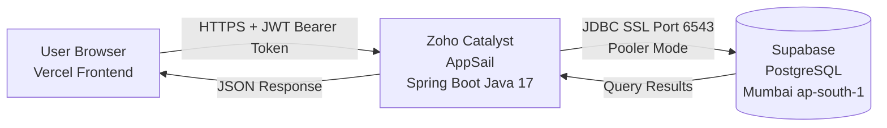

### How the Three Services Talk

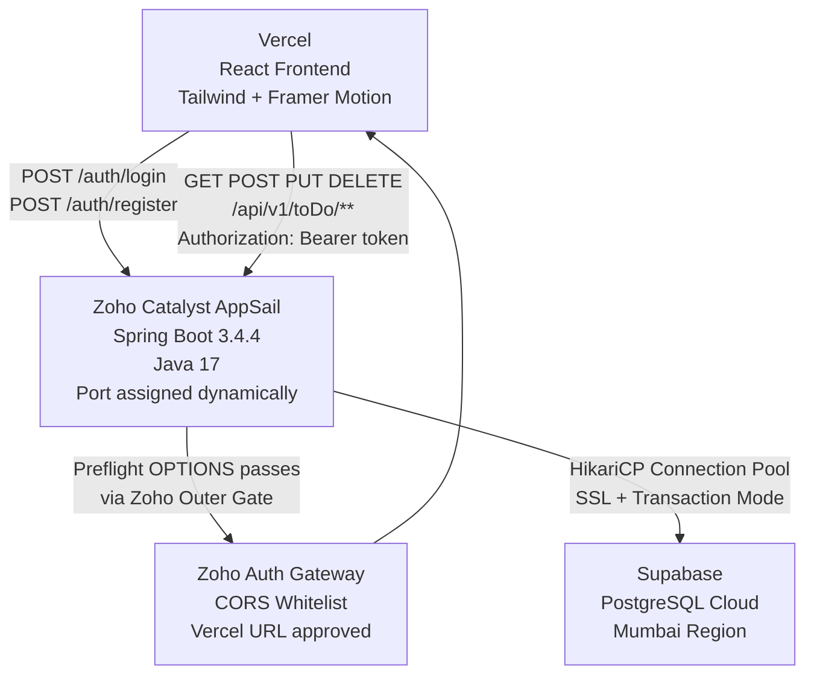

---

## 3. Tech Stack — A to Z

### 3.1 Backend

| Package | Full Form | Why We Use It |
|---|---|---|
| `spring-boot-starter-web` | Spring Web MVC Starter | Provides REST API support via `@RestController`. Includes embedded Apache Tomcat server. |
| `spring-boot-starter-data-jpa` | Spring Data JPA Starter | JPA = Java Persistence API. ORM via Hibernate. Write Java objects instead of SQL. |
| `spring-boot-starter-security` | Spring Security Starter | JWT filter chain, CORS configuration, BCrypt password hashing, route protection. |
| `spring-boot-starter-validation` | Bean Validation Starter | `@NotBlank`, `@NotNull`, `@Email` annotations on entity fields. |
| `postgresql` | PostgreSQL JDBC Driver | Allows Spring Boot to connect to PostgreSQL via JDBC. |
| `jjwt-api / jjwt-impl / jjwt-jackson` | Java JWT Library (JJWT) | Generates, signs, and validates JWT tokens using HMAC-SHA256 (HS256). |
| `lombok` | Project Lombok | `@Data`, `@Builder`, `@NoArgsConstructor`, `@AllArgsConstructor` — eliminates boilerplate. |
| `spring-boot-starter-test` | Spring Test Starter | JUnit + Mockito for unit and integration tests. |

### 3.2 Frontend

| Package | Full Form | Why We Use It |
|---|---|---|
| `React 19` | React JavaScript Library | Component-based UI library. Entire frontend is isolated, reusable components. |
| `Vite 8` | Vite Build Tool | Lightning-fast dev server with HMR. Much faster than Create React App. |
| `Tailwind CSS 4` | Tailwind CSS Framework | Utility-first — styles are class names inside JSX. No separate CSS files. |
| `@tailwindcss/vite` | Tailwind Vite Plugin | Integrates Tailwind into Vite's build pipeline. Must be in plugins array in `vite.config.js`. |
| `@vitejs/plugin-react` | Vite React Plugin | Enables JSX transformation and React Fast Refresh. |
| `react-router-dom 7` | React Router DOM | Client-side routing between `/login`, `/register`, `/dashboard` without page reloads. |
| `axios` | Axios HTTP Client | HTTP client with interceptors. Auto-attaches JWT token to every request. |
| `@tanstack/react-query 5` | TanStack Query | Server state management. Handles fetching, caching, loading states. Replaces `useEffect` for API calls. |
| `react-hook-form 7` | React Hook Form | Form validation without re-rendering on every keystroke. |
| `framer-motion 12` | Framer Motion | 3D card tilts, staggered entrance animations, spring physics, hover/tap effects. |
| `lucide-react` | Lucide React Icons | SVG icon library — Trash2, Edit2, LogOut, Plus, Check, RotateCcw icons. |
| `react-hot-toast` | React Hot Toast | Toast notifications for success/error feedback on login, register, CRUD. |
| `clsx + tailwind-merge` | Class Utility Helpers | Merge conditional Tailwind classes without conflicts. |
| `next-themes` | Next Themes | Dark/light mode theme state management. |

### 3.3 DevOps & Infrastructure

| Tool | Full Form | Purpose |
|---|---|---|
| Maven / `mvnw` | Apache Maven Wrapper | Java build tool. Compiles code, resolves dependencies, packages JAR. |
| Zoho Catalyst AppSail | Zoho Cloud Platform | Backend hosting. Assigns dynamic ports. 10-second startup window. |
| Vercel | Vercel Deployment Platform | Frontend hosting. Reads from GitHub. Auto-deploys on push. |
| Supabase | Supabase Cloud Database | Managed PostgreSQL. Mumbai region. Transaction pooler on port 6543. |
| HikariCP | HikariCP Connection Pool | Spring Boot's default JDBC connection pool. Manages Supabase connections. |
| Catalyst CLI | Zoho Catalyst Command Line Interface | `catalyst login`, `catalyst deploy` — pushes JAR to Zoho cloud. |

---

## 4. Backend Deep Dive

### 4.1 Project Structure

```
com.kk.HelloWorld/
├── HelloWorldApplication.java      @SpringBootApplication — Entry point
├── JwtFilter.java                  OncePerRequestFilter — Validates JWT on every request
│
├── config/
│   ├── SecurityConfig.java         Nuclear CORS Filter + JWT Security Chain
│   └── ServerPortCustomizer.java   Reads X_ZOHO_CATALYST_LISTEN_PORT env variable
│
├── controller/
│   ├── AuthController.java         POST /auth/register, POST /auth/login
│   ├── HealthController.java       GET / — Zoho health check endpoint
│   ├── ToDoController.java         Full CRUD — /api/v1/toDo/**
│   ├── HelloWorldController.java   GET /hello — test endpoint
│   └── KKController.java           GET /kk — test endpoint
│
├── models/
│   ├── ToDo.java                   @Entity — todo table
│   └── User.java                   @Entity — user_table
│
├── repository/
│   ├── ToDoRepository.java         extends JpaRepository<ToDo, Long>
│   └── UserRepository.java         extends JpaRepository<User, Long>
│
├── service/
│   ├── ToDoService.java            CRUD business logic + pagination
│   └── UserService.java            User creation
│
└── utils/
    └── JwtUtil.java                HS256 token generation + validation
```

### 4.2 The 3-Tier Layered Architecture

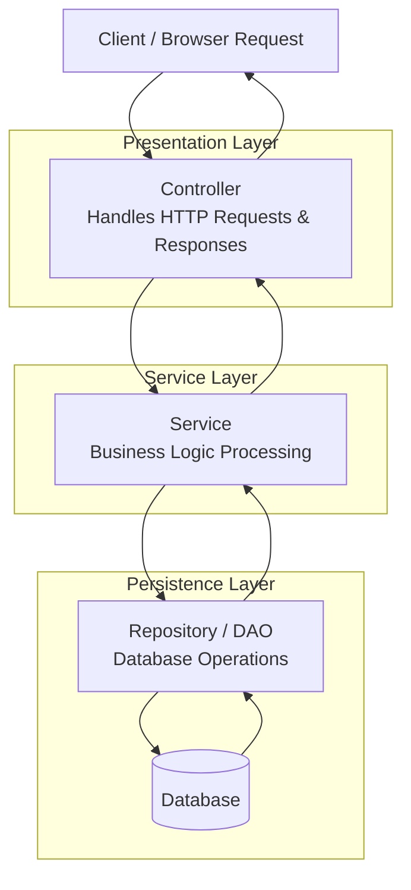

**Key Rule**: Layers never skip each other. Controller talks to Service only. Service talks to Repository only. Repository talks to the Database only.

### 4.3 Spring Core Concepts Applied

**Dependency Injection (DI):**
```java
@Service
public class ToDoService {
    @Autowired
    private ToDoRepository toDoRepository; // Spring injects this — not new ToDoRepository()
}
```

**Inversion of Control (IoC):** Spring's ApplicationContext creates and manages all Beans. We declare what we need, Spring provides it.

**Bean:** Any Java object managed by Spring's IoC container. Created by `@Component`, `@Service`, `@Repository`, `@Controller`, `@Configuration`.

**Open/Closed Principle Applied:**
- Switching REST → GraphQL? Only change the Controller layer.
- Switching PostgreSQL → MongoDB? Only change the Repository layer.
- Switching JWT → OAuth? Only change SecurityConfig + JwtFilter.

### 4.4 Maven — The Build Tool

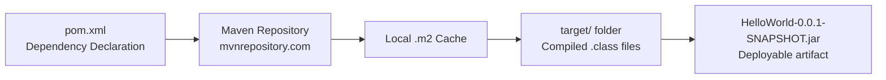

| Command | What It Does |
|---|---|
| `./mvnw clean` | Deletes `target/` folder |
| `./mvnw compile` | Compiles Java source to `.class` bytecode |
| `./mvnw clean package -DskipTests` | Builds final JAR, skips tests |
| `Ctrl+Shift+O` in IntelliJ | Reloads Maven — downloads new dependencies |

### 4.5 REST API — HTTP Methods

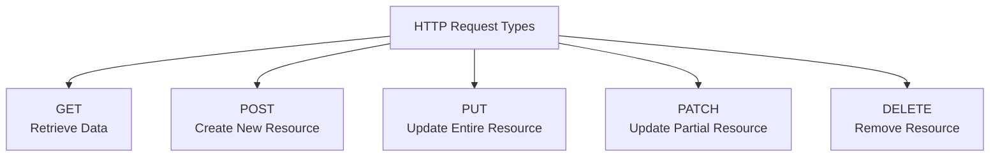

> Before REST there was **SOAP** — Simple Object Access Protocol — complex XML-based. REST uses simple URLs + HTTP methods and is the modern standard.

### 4.6 Spring Data JPA — ORM Layer

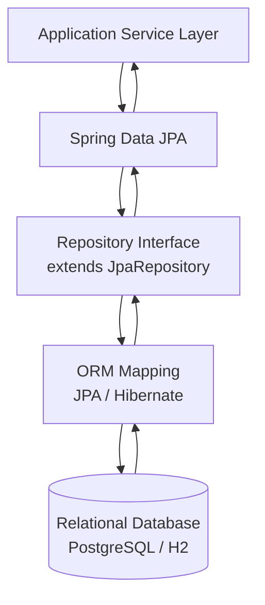

JPA annotation reference:

| Annotation | Purpose |
|---|---|
| `@Entity` | Maps Java class to a database table |
| `@Table(name="user_table")` | Overrides default table name |
| `@Id` | Marks the primary key |
| `@GeneratedValue` | Auto-increments ID on insert |
| `@NotBlank` | Field cannot be null, empty, or whitespace |
| `@NotNull` | Field cannot be null (for non-String types like Boolean) |
| `@Email` | Validates valid email format |

`JpaRepository` provides these methods for free — no SQL needed:

```java
toDoRepository.save(todo)          // INSERT / UPDATE
toDoRepository.findById(1L)        // SELECT WHERE id=1
toDoRepository.findAll()           // SELECT *
toDoRepository.deleteById(1L)      // DELETE WHERE id=1
toDoRepository.findByEmail(email)  // Custom derived query
```

### 4.7 Dynamic Port — ServerPortCustomizer

Zoho Catalyst assigns a random port to the app on every startup via an environment variable. This class reads it:

```java
@Configuration
public class ServerPortCustomizer
    implements WebServerFactoryCustomizer<ConfigurableServletWebServerFactory> {

    @Override
    public void customize(ConfigurableServletWebServerFactory factory) {
        String port = System.getenv("X_ZOHO_CATALYST_LISTEN_PORT");
        if (port != null) {
            factory.setPort(Integer.parseInt(port));
        } else {
            factory.setPort(8081); // local fallback
        }
    }
}
```

Without this, the app would try to bind to port 8081 on Zoho's server — but that port is not assigned to it, causing an immediate startup crash.

---

## 5. Frontend Deep Dive

### 5.1 Project Structure

```
react-todo-frontend/
├── index.html                    Single HTML file — id="root" (not id="app"!)
├── vite.config.js                plugins: [react(), tailwindcss()] — both required
├── package.json
│
└── src/
    ├── main.jsx                  Root — mounts React to #root
    ├── App.jsx                   React Router + TanStack Query + Toaster setup
    ├── index.css                 Tailwind @import + @theme dark mode variables
    │
    ├── api/
    │   ├── axios.js              baseURL from VITE_API_BASE_URL env var + JWT interceptor
    │   └── todoService.js        getAllTodos, createTodo, updateTodo, deleteTodo
    │
    ├── components/
    │   ├── layout/
    │   │   ├── AppLayout.jsx     Flex container — Sidebar + Main content
    │   │   ├── Header.jsx        Todoist logo + red Logout button
    │   │   └── Sidebar.jsx       Left nav with Inbox, Today links
    │   └── todos/
    │       ├── TaskList.jsx      Bento grid — maps todos → TaskItem cards
    │       └── TaskItem.jsx      Google Labs 3D card — tilt, hover, edit, delete
    │
    ├── hooks/
    │   └── useTodos.js           TanStack Query — useQuery + useMutation
    │
    └── pages/
        ├── Dashboard.jsx         Main authenticated view
        ├── Login.jsx             React Hook Form + toast notifications
        └── Register.jsx          React Hook Form + toast notifications
```

### 5.2 Data Flow — From Click to Database

```mermaid
flowchart LR
    A[User adds task\nTaskList.jsx]
    B[useTodos hook\naddTodoMutation]
    C[todoService.createTodo]
    D[axios.js\nAdds Bearer JWT header]
    E[Zoho AppSail\nSpring Boot]
    F[JwtFilter\nvalidates token]
    G[ToDoController\nPOST /api/v1/toDo/create]
    H[ToDoService]
    I[ToDoRepository\n.save]
    J[(Supabase\nPostgreSQL)]

    A --> B
    B --> C
    C --> D
    D -->|HTTPS| E
    E --> F
    F --> G
    G --> H
    H --> I
    I --> J
    J -->|saved entity| I
    I -->|201 Created| G
    G -->|JSON response| E
    E -->|response| D
    D -->|invalidateQueries| B
    B -->|re-fetch + re-render| A
```

### 5.3 Tailwind Dark Mode Theme

All custom colors are defined in `index.css` using `@theme`:

| Variable | Hex | Used For |
|---|---|---|
| `--color-background` | `#1f1f1f` | Main dark page background |
| `--color-foreground` | `#ffffff` | Primary text color |
| `--color-primary` | `#db4c3f` | Todoist signature red — buttons, highlights |
| `--color-secondary` | `#383838` | Secondary UI elements |
| `--color-muted` | `#2c2c2c` | Muted backgrounds |
| `--color-muted-foreground` | `#a8a8a8` | Secondary text, placeholders |
| `--color-border` | `#363636` | All borders |
| `--color-card` | `#2c2c2c` | Task card backgrounds |
| `--sidebar-background` | `#282828` | Sidebar + login card |

### 5.4 Framer Motion Animations

The `TaskItem.jsx` implements Google Labs-inspired bento grid cards with:

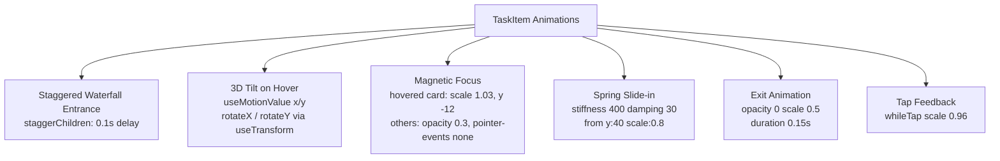

**Inline Edit Feature:** Clicking EDIT transforms the card title into an `<input>` with `autoFocus`. Pressing Enter or clicking SAVE sends a `PUT` request via `updateTodo`. Pressing CANCEL restores the original title without an API call.

---

## 6. API Reference

All protected endpoints require `Authorization: Bearer <token>` header.

| Method | Endpoint | Auth | Description | Response |
|---|---|---|---|---|
| `GET` | `/` | No | Health check for Zoho | `200 Backend is Live!` |
| `POST` | `/auth/register` | No | Register new user | `201 Created` / `409 Conflict` |
| `POST` | `/auth/login` | No | Login, returns JWT | `200 {token: "..."}` |
| `GET` | `/api/v1/toDo` | Yes | Get all todos | `200 List<ToDo>` |
| `GET` | `/api/v1/toDo/{id}` | Yes | Get specific todo | `200 ToDo` / `404` |
| `GET` | `/api/v1/toDo/page?page=0&size=5` | Yes | Paginated todos | `200 Page<ToDo>` |
| `POST` | `/api/v1/toDo/create` | Yes | Create new todo | `201 ToDo` |
| `PUT` | `/api/v1/toDo` | Yes | Update todo | `200 ToDo` |
| `DELETE` | `/api/v1/toDo/{id}` | Yes | Delete todo | `200 String` |
| `GET` | `/hello` | No* | Test endpoint | `200 Hello World!` |
| `GET` | `/kk` | No* | Test endpoint | `200 Hello KK!` |

**ToDo entity schema:**
```json
{
  "id": 1,
  "title": "Complete Spring Boot deployment",
  "isCompleted": false
}
```

---

## 7. Database Strategy

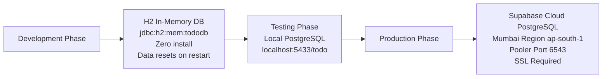

Switching between databases requires only 3 lines in `application.properties`. All `@Entity` classes and JPA repositories stay exactly the same — this is the power of JPA abstraction.

### Supabase Connection Configuration

```properties
spring.datasource.url=jdbc:postgresql://aws-1-ap-south-1.pooler.supabase.com:6543/postgres?sslmode=require&prepareThreshold=0
```

- **Port 6543** — Transaction Pooler (not direct port 5432). Required for cloud-to-cloud networking.
- **`sslmode=require`** — Mandatory for Supabase connections.
- **`prepareThreshold=0`** — Disables prepared statements for pooler compatibility in Transaction Mode.
- **Mumbai region** — Closest to Zoho Catalyst's Chennai data center, minimizing latency.

### H2 Console — The Development Journey

Getting the H2 console working was one of the first major debugging challenges:

- **Root cause:** Spring Boot **4.0.4** broke H2 console auto-registration in `DispatcherServlet`
- **Fix:** Downgraded to Spring Boot **3.4.4** + `Build → Clean Project` in IntelliJ
- **Key lesson:** Always clean the `target/` folder after changing Spring Boot versions. Old compiled `.class` files override new configuration.

---

## 8. Security — JWT & Spring Security

### JWT Token Flow

```mermaid
flowchart LR
    A[User / Client]
    B[Postman / Browser]
    C[Spring Boot API Server]
    D[JwtFilter\nSecurity Layer]
    E[(Database)]

    A --> B
    B -->|POST /auth/login\nemail + password| C
    C --> D
    D -->|Validate credentials\nBCrypt.matches| E
    E --> D
    D -->|Generate JWT HS256| C
    C -->|200 OK\n{token: eyJhbG...}| B
    B --> A
```

### Every Subsequent Request

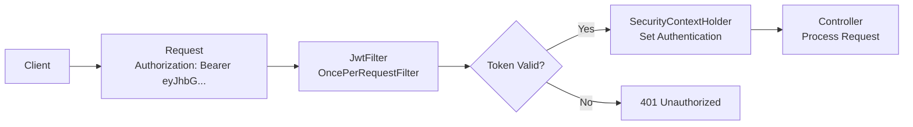

### JWT Structure

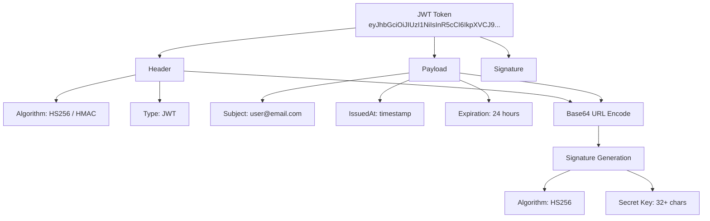

### Security Concepts Reference

| Concept | Full Form | What It Means |
|---|---|---|
| JWT | JSON Web Token | Signed token. Stateless — server never stores sessions. |
| HS256 | HMAC SHA-256 | Symmetric signing. Secret key must be 32+ characters. |
| BCrypt | Blowfish Crypt | One-way password hashing. Never stores plain text passwords. |
| CSRF | Cross-Site Request Forgery | Disabled for REST APIs since we use stateless JWT. |
| CORS | Cross-Origin Resource Sharing | Browser policy blocking requests from different origins. |
| Authentication | — | Verifying WHO the user is (login). |
| Authorisation | — | Verifying WHAT the user can access (JWT on each request). |

### The Nuclear CORS Fix

Standard CORS config inside Spring Security's filter chain was insufficient — Zoho's outer gateway and Spring's internal chain were conflicting. The solution was a `FilterRegistrationBean` with `Ordered.HIGHEST_PRECEDENCE`:

```java
@Bean
public FilterRegistrationBean<CorsFilter> corsFilter() {
    // This runs BEFORE Spring Security's filter chain
    bean.setOrder(Ordered.HIGHEST_PRECEDENCE);
    return bean;
}
```

---

## 9. DevOps & Cloud Deployment

### The Deployment Architecture

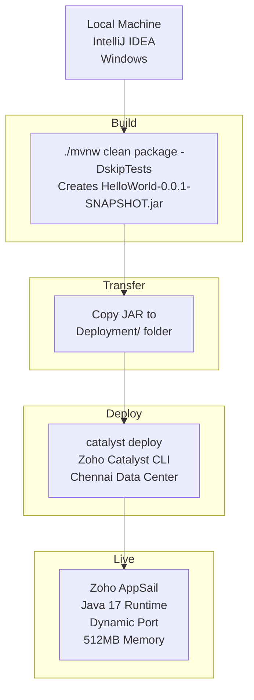

### Manual CI/CD Pipeline

Every deployment follows this ritual:

```bash
# Step 1 — Build
cd D:\SpringToDo\HelloWorld
./mvnw clean package -DskipTests

# Step 2 — Transfer
copy target\HelloWorld-0.0.1-SNAPSHOT.jar ..\Deployment\

# Step 3 — Deploy
cd ..\Deployment
catalyst deploy

# Step 4 — Monitor
# Watch Zoho Catalyst Dashboard → Logs → SpringReactToDoByKK
```

### Zoho Catalyst Configuration

**`app-config.json`:**
```json
{
    "command": "java -jar HelloWorld-0.0.1-SNAPSHOT.jar",
    "stack": "java17",
    "memory": 512,
    "platform": "javase",
    "health_check": {
        "type": "http",
        "path": "/",
        "initial_delay": 30
    }
}
```

**`HealthController.java`** — the Zoho "heartbeat" endpoint:
```java
@GetMapping("/")
public String health() {
    return "Backend is Live!";
}
```

Zoho sends a `GET /` request after 30 seconds. If it receives `200 OK`, the app is marked live. If it receives `403 Forbidden` or no response, Zoho kills and restarts the container.

### The 10-Second Startup Race

Zoho Catalyst allows **10 seconds** for a managed Java app to start. The app was consistently starting in 9.1–9.7 seconds, failing the health check by milliseconds. Solutions applied:

| Optimization | Time Saved |
|---|---|
| `spring.jpa.hibernate.ddl-auto=none` (skip table scanning) | ~3 seconds |
| `spring.main.lazy-initialization=true` | ~2 seconds |
| `spring.data.jpa.repositories.bootstrap-mode=lazy` | ~1 second |
| Removing Swagger / SpringDoc dependency | ~2 seconds |
| `HealthController` responding to `GET /` | Health check passes |

**Result:** Startup time reduced from ~14 seconds to ~6 seconds.

### Java Version Migration

| Phase | Java Version | Reason |
|---|---|---|
| Local Development | Java 21 | Latest LTS on local machine |
| Cloud Deployment | Java 17 | Zoho Catalyst Managed Runtime supports Java 17 |

Change in `pom.xml`:
```xml
<java.version>17</java.version>
```

### Vercel Frontend Deployment

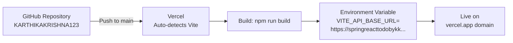

**`axios.js` — Environment-aware base URL:**
```javascript
const API_URL = import.meta.env.VITE_API_BASE_URL
    || 'https://springreacttodobykk-50040626068.development.catalystappsail.in';
```

---

## 10. The CORS Battle — 24 Hours of Debugging

This was the final boss. The journey from "CORS error" to "live and working" involved multiple layers:

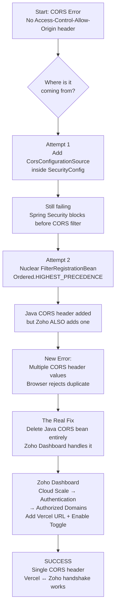

### The "Multiple Values" Conflict

Once Zoho's outer gateway was configured to whitelist the Vercel URL, it started adding the `Access-Control-Allow-Origin` header automatically. But the Java `SecurityConfig` was also adding it. The browser received two values and rejected both.

**Fix:** Remove the `FilterRegistrationBean<CorsFilter>` from `SecurityConfig.java` entirely. Let Zoho's gateway be the sole CORS authority.

### What The Error Messages Actually Meant

| Error | What Was Really Happening |
|---|---|
| `"Email might already be taken"` | False alarm — request never reached database. CORS bouncer at frontend. |
| `net::ERR_FAILED` | CORS preflight OPTIONS blocked |
| `No Access-Control-Allow-Origin header` | Backend not responding / CORS not configured |
| `Multiple CORS header values` | Both Zoho AND Java were adding the header |
| `Execution failed. Please check startup command or port` | App crashed before Tomcat started — database connection or port issue |

---

## 11. Learning Journey — Spring Boot from Zero

This project was built from **zero Java web framework knowledge** in Alangulam, Tenkasi, Tamil Nadu, India. Every concept below was learned by building, breaking, and fixing this project.

### Week-by-Week Learning

| Week | Concept | Key Takeaway |
|---|---|---|
| 1 | Spring Boot project generation via `start.spring.io` | Maven generates the full skeleton. `mvnw` runs without global Maven install. |
| 1 | Apache Tomcat embedded server | Spring Boot bundles its own mini-server. No external install needed. |
| 1 | REST vs SOAP | Before REST: SOAP (XML-based, complex). REST: URLs + HTTP methods (simple). |
| 1 | `@RestController`, `@GetMapping` | Controller file controls what each endpoint does. |
| 2 | 3-Tier Architecture | Controller → Service → Repository → Database. Layers never skip. |
| 2 | Dependency Injection & IoC | Spring creates and injects objects. `@Autowired` = "give me this Bean". |
| 2 | `@SpringBootApplication` | Contains `@EnableAutoConfiguration` + `@ComponentScan`. Scans all classes. |
| 2 | Request Params vs Path Variables vs Request Body | 3 ways to send input: `?key=value`, `/{id}`, JSON body. |
| 3 | JPA and Hibernate ORM | `@Entity` maps Java → table. `JpaRepository` gives free CRUD. |
| 3 | H2 In-Memory Database | Zero-install dev database. Spring Boot 4.x broke it — use 3.x. |
| 3 | H2 Console debugging | Took multiple sessions. Root cause: Boot 4.0.4 bug + stale `.class` files. |
| 4 | Spring Security Filter Chain | Every request passes through filters before reaching controllers. |
| 4 | JWT Authentication | 3-part token: Header.Payload.Signature. Stored in localStorage. |
| 4 | BCrypt Password Hashing | Never store plain text. `BCryptPasswordEncoder.matches()` for comparison. |
| 4 | CORS configuration | Browser blocks cross-origin requests. Must explicitly allow Vercel URL. |
| 5 | React + Vite + Tailwind | Both `react()` AND `tailwindcss()` needed in `vite.config.js` plugins. |
| 5 | Axios interceptors | Auto-attach JWT token to every API request. No manual headers per call. |
| 5 | TanStack Query | Replaces `useEffect`. `invalidateQueries` refreshes UI after mutations. |
| 5 | URL mismatch 403 Forbidden | Frontend called `/todos` but backend mapped to `/api/v1/toDo`. Always verify. |
| 6 | PostgreSQL migration | H2 → PostgreSQL = 3 lines in `application.properties`. Same `@Entity` code. |
| 6 | Email already exists bug | `ddl-auto=update` never clears data. Fix: `TRUNCATE TABLE user_table`. |
| 7 | Cloud deployment — Zoho Catalyst | Java 17 required. Dynamic port via `ServerPortCustomizer`. 10-second window. |
| 7 | Supabase cloud database | Pooler port 6543. `sslmode=require`. `prepareThreshold=0`. Mumbai region. |
| 7 | The localhost trap | `localhost` in the cloud = the cloud server itself, not your laptop. |
| 7 | CORS — the final boss | 24 hours. Nuclear filter. Zoho dashboard whitelist. Duplicate header conflict. |

### The Biggest Lessons

1. **Spring Boot 4.x is cutting-edge but unstable** — Use 3.4.x for reliable H2 and production-grade behavior.
2. **Always clean after version changes** — Old `.class` files in `target/` override everything.
3. **The localhost trap** — `localhost` in cloud config always means the cloud server, not your machine.
4. **CORS is a browser policy, not a server error** — The browser blocks it. The server must explicitly allow the origin.
5. **Zoho has two CORS layers** — Java code + Zoho dashboard. Having both creates duplicate header conflicts.
6. **`ddl-auto=none` is fastest in production** — Tables already exist. Don't scan on every boot.
7. **JWT is stateless** — The token IS the authentication. The server stores nothing.

---

## 12. Known Issues & Fixes

| Issue | Root Cause | Fix Applied |
|---|---|---|
| Port 8080 already in use | Old Spring Boot instance still running | `taskkill /PID <id> /F` or `server.port=8081` |
| H2 console 404 | Spring Boot 4.0.4 broke H2 registration | Downgrade to 3.4.4 + `Build → Clean Project` |
| Spring Security login page | `spring-boot-starter-security` added twice | Remove duplicate from `pom.xml` |
| `annotation values must be of the form name=value` | `@ComponentScan` wrong syntax for multiple packages | Use `basePackages = {}` or remove `@ComponentScan` entirely |
| `SecurityConfig.java` not found | File in wrong folder (`src/main/java/` root) | Move to `com.kk.HelloWorld.config` package |
| `cannot find symbol AntPathRequestMatcher` | Removed in Spring Security 6.x | Deleted premature SecurityConfig |
| Email Already Exists for every registration | Stale PostgreSQL data + `ddl-auto=update` | `TRUNCATE TABLE user_table` in pgAdmin |
| `GET /todos 403 Forbidden` | Frontend URL `/todos` vs backend `/api/v1/toDo` | Fixed URLs in `todoService.js` |
| `npm run dev` blank page | `@vitejs/plugin-react` not installed, `id="app"` not `"root"` | `npm install -D @vitejs/plugin-react` + fix `index.html` |
| Tailwind styles not applying | `tailwindcss()` missing from `vite.config.js` plugins | Add to `plugins: [react(), tailwindcss()]` |
| `ConflictingBeanDefinitionException` | Two `ServerPortCustomizer` in different packages | Delete the one in root package, keep `config/` version |
| `Execution failed. Please check startup command or port` | App not starting within 10s — Supabase connection timeout | `ddl-auto=none` + lazy init + correct Mumbai region URL |
| CORS Multiple Values Error | Both Zoho dashboard AND Java both adding CORS header | Remove Java CORS bean, let Zoho dashboard handle it |
| Corrupted JDBC URL | Double `jdbc:jdbc:` prefix + credentials embedded in URL | Replace entire `application.properties` with clean version |

---

## 13. Local Development Setup

### Prerequisites

| Tool | Version | Download |
|---|---|---|
| Java JDK | 17 (for Zoho compatibility) | https://adoptium.net |
| IntelliJ IDEA | Community Edition | https://jetbrains.com/idea |
| Node.js | 18+ | https://nodejs.org |
| PostgreSQL | 15+ (optional for local) | https://postgresql.org |
| Git | Latest | https://git-scm.com |

### Backend Setup

```bash
# Clone repository
git clone https://github.com/KARTHIKAKRISHNA123/Spring-React-ToDo-NM.git
cd Spring-React-ToDo-NM/HelloWorld

# Open in IntelliJ and let Maven sync

# For local development with H2 (uncomment in application.properties):
# spring.datasource.url=jdbc:h2:mem:tododb;DB_CLOSE_DELAY=-1
# spring.datasource.username=sa
# spring.datasource.password=
# spring.h2.console.enabled=true

# Run
./mvnw spring-boot:run

# Verify
# http://localhost:8081/
# http://localhost:8081/hello
```

### Frontend Setup

```bash
cd react-todo-frontend
npm install

# For local development, create .env:
# VITE_API_BASE_URL=http://localhost:8081

npm run dev
# → http://localhost:5173
```

### Environment Variables

| Variable | Where | Value |
|---|---|---|
| `VITE_API_BASE_URL` | Vercel Dashboard / `.env` | Zoho AppSail URL |
| `X_ZOHO_CATALYST_LISTEN_PORT` | Zoho (auto-set) | Dynamic port assigned by Catalyst |

---

## 14. Architectural Diagrams

### Full System Architecture

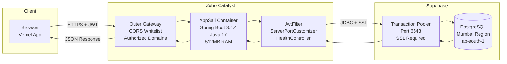

### Java → Spring Framework → Spring Boot Hierarchy

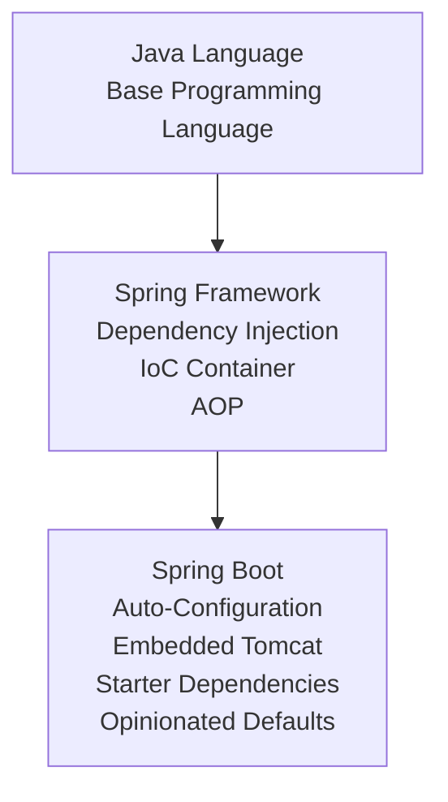

### Client-Server Communication

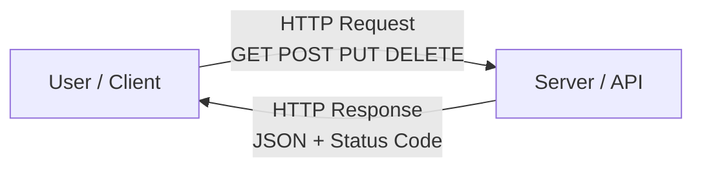

### Spring Security Filter Chain

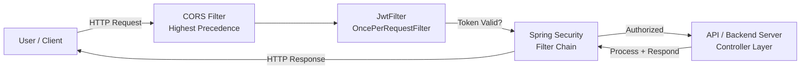

### Port and Network Routing

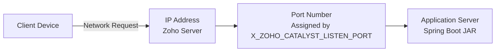

---

## Project Status

| Feature | Status |
|---|---|
| Spring Boot backend | ✅ Complete |
| JWT authentication (register + login) | ✅ Complete |
| Full CRUD todo operations | ✅ Complete |
| Pagination support | ✅ Complete |
| H2 in-memory database (dev) | ✅ Complete |
| PostgreSQL Supabase (production) | ✅ Complete |
| React frontend — Todoist dark mode | ✅ Complete |
| Google Labs 3D bento grid UI | ✅ Complete |
| Framer Motion animations | ✅ Complete |
| Axios JWT interceptor | ✅ Complete |
| TanStack Query integration | ✅ Complete |
| react-hot-toast notifications | ✅ Complete |
| Backend deployed — Zoho Catalyst | ✅ Live |
| Frontend deployed — Vercel | ✅ Live |
| Database deployed — Supabase | ✅ Live |
| CORS resolved end-to-end | ✅ Resolved |
| Edit inline CRUD | ✅ Complete |

---

## License

MIT License — See `LICENSE` for details.

---

## Author

**Karthika Krishna M**
GitHub: [@KARTHIKAKRISHNA123](https://github.com/KARTHIKAKRISHNA123)

